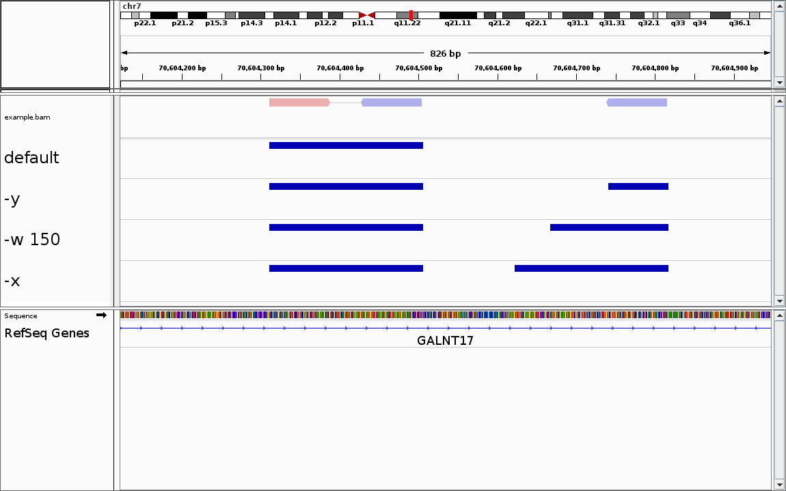
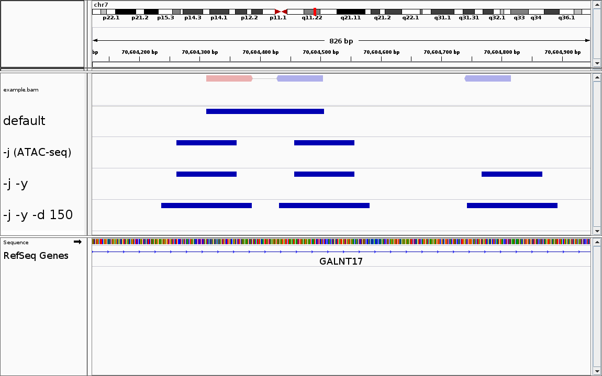

# Genrich: detecting sites of genomic enrichment

## Table of Contents
* [Introduction](#intro)
  * [Quick start](#quick)
  * [Software compilation](#compile)
  * [Usage message](#usage)
* [Peak-calling method](#method)
* [I/O files and options](#files)
  * [Required files](#required)
  * [Optional files](#optional)
* [Filtering options](#filter)
  * [Unpaired alignments](#unpaired)
* [ATAC-seq mode](#atacseq)
* [Peak calling](#peakcalling)
* [Miscellaneous](#misc)
* [Contact](#contact)
<br><br>

## Introduction <a name="intro"></a>

Genrich is a peak-caller for genomic enrichment assays (e.g. ChIP-seq, ATAC-seq).  It analyzes alignment files generated following the assay and produces a peak file.
<br><br>

### Quick start <a name="quick"></a>

Given:
* `sample.bam` (alignment file)
* `Genrich` (compiled as described [below](#compile))
<br><br>

To produce a file listing regions of genomic enrichment:
```
$ ./Genrich  -t sample.bam  -o sample.narrowPeak
```
<br>

### Software compilation <a name="compile"></a>

The software can be downloaded from [GitHub](https://github.com/jsh58/Genrich).

A Makefile is provided for compilation with [GCC](https://gcc.gnu.org/releases.html), and [zlib](http://zlib.net) is also required.  The program has been tested after compilation with GCC 5.4.0 and zlib 1.2.8.

To compile, run `make` in the folder in which the software was downloaded.  The executable `Genrich` should be produced.
<br><br>


### Usage message <a name="usage"></a>

```
Usage: ./Genrich  -t <file>  -o <file>  [optional arguments]
Required arguments:
  -t  <file>       Input SAM/BAM file(s) for treatment sample(s)
  -o  <file>       Output peak file (in ENCODE narrowPeak format)
Optional I/O arguments:
  -c  <file>       Input SAM/BAM file(s) for control sample(s)
                     (matched with -t files; 'null' if missing)
  -f  <file>       Output bedgraph-ish file for p/q values
  -k  <file>       Output bedgraph-ish file for pileups and p-values
  -b  <file>       Output BED file for reads/fragments/intervals
Filtering options:
  -e  <arg>        Comma-separated list of chromosomes to ignore
  -E  <file>       Input BED file(s) of genomic regions to ignore
  -m  <int>        Minimum MAPQ to keep an alignment (def. 0)
  -s  <float>      Keep sec alns with AS >= bestAS - <float> (def. 0)
  -y               Keep unpaired alignments (def. false)
  -w  <int>        Keep unpaired alns, lengths changed to <int>
  -x               Keep unpaired alns, lengths changed to paired avg
Options for ATAC-seq:
  -j               Use ATAC-seq mode (def. false)
  -d  <int>        Expand cut sites to <int> bp (def. 100)
Options for peak calling:
  -q  <float>      Maximum q-value (FDR-adjusted p-value; def. 0.05)
  -p  <float>      Maximum p-value (overrides -q if set)
  -a  <float>      Minimum AUC for a peak (def. 20.0)
  -l  <int>        Minimum length of a peak (overrides -a if set)
  -g  <int>        Maximum distance between signif. sites (def. 100)
Other options:
  -z               Option to gzip-compress output(s)
  -v               Option to print status updates/counts to stderr
```
<br>

## Peak-calling method <a name="method"></a>

(coming soon)


## I/O files and options <a name="files"></a>

### Required files <a name="required"></a>

```
  -t  <file>       Input SAM/BAM file(s) for treatment sample(s)
```
Genrich analyzes alignment files in [SAM/BAM format](https://samtools.github.io/hts-specs/SAMv1.pdf).  SAM files must have a header.

SAM/BAM files for multiple replicates can be specified, comma-separated (or space-separated, in quotes).  Multiple SAM/BAM files for a single replicate should be combined in advance via `samtools merge`.

The SAM/BAM files should be name sorted (via `samtools sort -n`).  As of [Version 0.3](https://github.com/jsh58/Genrich/releases/tag/v0.3), unsorted SAM/BAM files are allowed, but this is likely to change.
<br><br>

```
  -o  <file>       Output peak file (in ENCODE narrowPeak format)
```
As indicated, the output file is in [ENCODE narrowPeak format](https://genome.ucsc.edu/FAQ/FAQformat.html#format12).  Here are additional details of the fields:
<table>
  <tr>
    <td align="center">4. name</td>
    <td><code>peak_N</code>, where <code>N</code> is the 0-based count</td>
  </tr>
  <tr>
    <td align="center">5. score</td>
    <td>10*qValue (or 10*pValue if <code>-p</code> is set), rounded to the nearest int (max. 1000)</td>
  </tr>
  <tr>
    <td nowrap align="center">7. signalValue</td>
    <td>Total area under the curve, in default peak-calling mode.  In minimum-length peak-calling mode (<code>-l</code>), the summit fold-enrichment (treatment / control) with one replicate, or the pValue/qValue with multiple replicates.</td>
  </tr>
  <tr>
    <td align="center">8. pValue</td>
    <td>Summit -log<sub>10</sub>(<i>p</i>-value)</td>
  </tr>
  <tr>
    <td align="center">9. qValue</td>
    <td>Summit -log<sub>10</sub>(<i>q</i>-value), or -1 with <code>-p</code></td>
  </tr>
  <tr>
    <td align="center">10. peak</td>
    <td>Summit position: the midpoint of the interval reaching the highest significance (the longest interval in case of ties)</td>
  </tr>
</table>
<br>

### Optional files <a name="optional"></a>

```
  -c  <file>       Input SAM/BAM file(s) for control sample(s)
                     (matched with -t files; 'null' if missing)
```
Alignment files for control samples can be specified.  As indicated, they should be matched with treatment files.
<br><br>

```
  -f  <file>       Output bedgraph-ish file for p/q values
```
When Genrich analyzes a single replicate, this log file lists treatment/control pileup values, *p*- and *q*-values, and significance (`*`) for each interval.  With multiple replicates, it lists *p*-values of each replicate, combined *p*-value, *q*-value, and significance for each interval.

Note that this file (as well as the `-k` file, below) is called "bedgraph-ish" because it contains multiple `dataValue` fields, which isn't strictly allowed in the [bedGraph format](https://genome.ucsc.edu/goldenpath/help/bedgraph.html).  However, a simple application of `awk` can produce the desired bedgraph files for visualization purposes.
<br><br>

```
  -k  <file>       Output bedgraph-ish file for pileups and p-values
```
For each replicate, sequentially, this file lists a header line (`# treatment file: <name>; control file: <name>`), followed by treatment/control pileups and a *p*-value for each interval. This is the way to examine pileup values with multiple replicates, since the `-f` file will not supply them.
<br><br>

```
  -b  <file>       Output BED file for reads/fragments/intervals
```
This is an unsorted [BED file](https://genome.ucsc.edu/FAQ/FAQformat.html#format1) of the reads/fragments/intervals analyzed. The 4th column gives the read name, number of alignments, 'T'reatment or 'C'ontrol, and sample number (0-based), e.g. `SRR5427885.57_2_T_0`.
<br><br>

## Filtering options <a name="filter"></a>

```
  -e  <arg>        Comma-separated list of chromosomes to ignore
```
* All alignments to the given list of chromosomes (reference sequences) will be ignored.  The alignments' lengths will not factor into the total sequence information calculation, nor to the average fragment length calculation (`-x`), and the alignments will not be printed to the `-b` file.
* For reads/fragments with multiple alignments, the scores of alignments to `-e` chromosomes **will** be considered for comparison purposes.
* Counts of skipped alignments will be printed to `stderr` as part of the optional verbose (`-v`) output.
* The lengths of the `-e` chromosomes will be subtracted from the total genome length calculated by the program.
<br><br>

```
  -E  <file>       Input BED file(s) of genomic regions to ignore
```
* All alignments, or portions of alignments, that lie within the given genomic regions will be ignored.  The alignments' lengths (within an ignored region) will not factor into the total sequence information calculation, but the full fragment length **will** be counted for the average fragment length calculation (`-x`), and the full fragment **will** be listed in the `-b` file.
* The regions will affect peak calls, such that no peak may extend into or around an excluded region.
* In the output log files (`-f`, `-k`), excluded regions will have treatment/control pileup values of `0.0` and *p*-/*q*-values of `NA`.
* Multiple BED files can be specified, comma-separated (or space-separated, in quotes).
* The regions' lengths will be subtracted from the total genome length calculated by the program.
* The accessory script [`findNs.py`](https://github.com/jsh58/Genrich/blob/master/findNs.py) will produce a BED file of 'N' homopolymers in a fasta file (e.g. a reference genome).  Its output should be given to Genrich via `-E`.
<br><br>

```
  -m  <int>        Minimum MAPQ to keep an alignment (def. 0)
```
* All alignments with `MAPQ` less than the given value will be ignored.  This is equivalent to filtering with `samtools view -q <int>`.
* This option should not be used if the SAM/BAM lists multiple alignments for some reads/fragments (e.g. produced via `bowtie2 -k20`, listing up to 20 alignments for each read).  Instead, filtering should be accomplished via `-s <float>`, below.
<br><br>

```
  -s  <float>      Keep sec alns with AS >= bestAS - <float> (def. 0)
```
* Genrich analyzes all secondary alignments, but, by default, it keeps only the alignments whose scores (`AS`) are equal to the best score for the read/fragment.  Setting a value such as `-s 20` will cause Genrich also to keep secondary alignments whose scores are within 20 of the best.
* The SAM/BAM should have alignment scores under the extra field `AS`.  If not, all alignments will be considered equivalent.
* Each of the `n` alignments for a read/fragment is counted as `1/n` for the pileup.
* To avoid excessive memory usage and the imprecision inherent in floating-point values, a maximum of 10 alignments per read is analyzed by Genrich.  Reads with more than 10 alignments will be subsampled based on the best alignment scores; in the case of ties, alignments appearing first in the SAM/BAM are favored.
* The alignment score for a fragment (pair of reads) is equal to the sum of the reads' individual scores.
* Properly paired alignments take precedence over singleton alignments, regardless of the alignment scores.
* The short read aligner [Bowtie2](http://bowtie-bio.sourceforge.net/bowtie2/manual.shtml) produces secondary alignments in either [`-k <int>` mode](http://bowtie-bio.sourceforge.net/bowtie2/manual.shtml#k-mode-search-for-one-or-more-alignments-report-each) or [`-a` mode](http://bowtie-bio.sourceforge.net/bowtie2/manual.shtml#a-mode-search-for-and-report-all-alignments).
* The short read aligner [BWA](http://bio-bwa.sourceforge.net/bwa.shtml) does not produce secondary alignments.
<br><br>

### Unpaired alignments <a name="unpaired"></a>

By default, Genrich analyzes only properly paired alignments and infers the full fragments as spanning between the 5' ends of the two alignments (Fig. 1).  It does not analyze unpaired ("singleton") alignments unless one of three options is selected:
```
  -y               Keep unpaired alignments (def. false)
  -w  <int>        Keep unpaired alns, lengths changed to <int>
  -x               Keep unpaired alns, lengths changed to paired avg
```
* `-y`: unpaired alignments will be kept, just as they appear in the SAM/BAM
* `-w <int>`: unpaired alignments will be kept, with their lengths changed to the given value (from their 5' ends)
* `-x`: unpaired alignments will be kept, with their lengths changed to the average value calculated from the properly paired alignments (excluding those aligning to skipped chromosomes [`-e`])

<figure>
  
  <figcaption><strong>Figure 1.</strong>  Analysis of alignments by Genrich.  The BAM file has both properly paired alignments (top left) and unpaired "singleton" alignments (top right).  By default, Genrich infers the full fragments from the paired alignments and discards the unpaired alignments.  Unpaired alignments can be kept via <code>-y</code>, <code>-w &lt;int&gt;</code>, or <code>-x</code>, as described above.</figcaption>
</figure>
<br>

## ATAC-seq mode <a name="atacseq"></a>

[ATAC-seq](https://informatics.fas.harvard.edu/atac-seq-guidelines.html#overview) is a method for assessing genomic regions of open chromatin.  Since only the ends of the DNA fragments indicate where the transposase enzyme was able to insert into the chromatin, it may not be optimal to interpret alignments as shown above (Fig. 1).  Genrich has an alternative analysis mode for ATAC-seq in which it will create intervals centered on cut sites (defined by the ends of the fragments).

```
  -j               Use ATAC-seq mode (def. false)
  -d  <int>        Expand cut sites to <int> bp (def. 100)
```

<figure>
  
  <figcaption><strong>Figure 2.</strong>  ATAC-seq mode of Genrich.  Genrich analyzes intervals centered on cut sites (both ends of the full fragments, as well as the 5' ends of unpaired alignments if <code>-y</code> is set).  The lengths of the intervals can be changed from the default of <code>-d 100</code>.</figcaption>
</figure>
<br>

Note that unpaired alignments can be analyzed with `-y`, though only one interval, centered on the read's 5' end, will be inferred.  Both `-w <int>` and `-x` are equivalent to `-y` in ATAC-seq mode.
<br><br>


## Peak calling <a name="peakcalling"></a>

```
  -q  <float>      Maximum q-value (FDR-adjusted p-value; def. 0.05)
```
This is the threshold below which a base is considered significantly enriched in the treatment vs. the control/background.  The *q*-value for each non-excluded base of the genome is calculated from the *p*-value using the [Benjamini-Hochberg procedure](http://www.math.tau.ac.il/~ybenja/MyPapers/benjamini_hochberg1995.pdf) and the calculated genome length.
<br><br>

```
  -p  <float>      Maximum p-value (overrides -q if set)
```
When selected, the chosen threshold will be used to judge significance based on *p*-values, and *q*-values will not be calculated (reported as -1).
<br><br>

```
  -a  <float>      Minimum AUC for a peak (def. 20.0)
```
* The default peak-calling method requires that, for a peak to be called, the total significance of the region must exceed a minimum value. The total significance is calculated as the sum of the -log(*q*) values above the `-q` threshold over the length of the region (i.e. the area under the -log(*q*) "curve").
* If a `-p` threshold is specified, the area under the -log(*p*) curve is calculated.
<br><br>

```
  -l  <int>        Minimum length of a peak (overrides -a if set)
```
* This option overrides the default peak-calling method (`-a`) and instead requires that peaks be at least the specified minimum length.  Any potential peaks whose lengths are below that threshold are eliminated, regardless of the significance.
<br><br>

```
  -g  <int>        Maximum distance between signif. sites (def. 100)
```
* This parameter sets the maximum distance between sites that achieve significance in order for them to be linked together into the same potential peak.  It applies with both `-a` and `-l`.
<br><br>


## Miscellaneous <a name="misc"></a>

```
  -z               Option to gzip-compress output(s)
```
When selected, all output files will be gzip-compressed.
<br><br>

```
  -n  <int>        Number of threads to use (def. 1)
```
(not currently implemented)
<br><br>

Other options:
```
  -v/--verbose     Option to print status updates/counts to stderr
  -h/--help        Print the usage message and exit
  -V/--version     Print the version and exit
```
<br>

## Contact <a name="contact"></a>

Genrich

Copyright &copy; 2018  John M. Gaspar (jsh58@wildcats.unh.edu)

