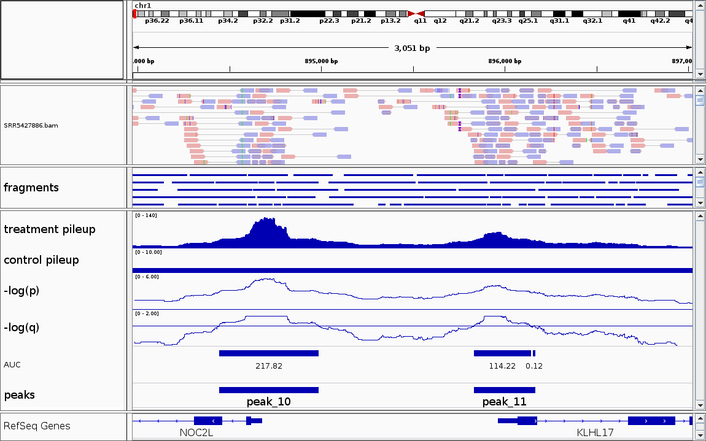
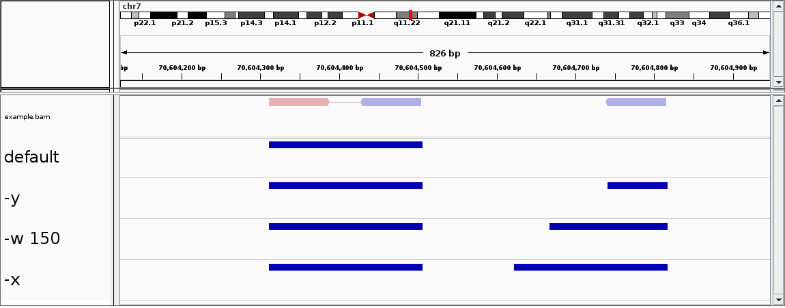

# Genrich: detecting sites of genomic enrichment

## Table of Contents
* [Introduction](#intro)
  * [Quick start](#quick)
  * [Software compilation](#compile)
  * [Usage message](#usage)
* [Attributes](#attributes)
  * [Peak-calling method](#method)
  * [Alignment parsing](#alignment)
  * [Multimapping reads](#multimap)
  * [PCR duplicate removal](#duplicate)
  * [Genome length calculation](#genomelen)
  * [Control/background pileup calculation](#pileup)
  * [*p*-value calculation](#pvalue)
  * [*q*-value calculation](#qvalue)
  * [Multiple replicates](#replicate)
* [I/O files and options](#files)
  * [Required files](#required)
  * [Optional files](#optional)
* [Filtering options](#filter)
  * [Unpaired alignments](#unpaired)
* [ATAC-seq mode](#atacseq)
* [Peak-calling parameters](#peakcalling)
* [Miscellaneous](#misc)
  * [Full analysis example](#example)
  * [Warning messages](#warning)
  * [Computational requirements](#memory)
* [Contact](#contact)
<br><br>

## Introduction<a name="intro"></a>

Genrich is a peak-caller for genomic enrichment assays (e.g. ChIP-seq, ATAC-seq).  It analyzes alignment files generated following the assay and produces a file detailing peaks of significant enrichment.


### Quick start<a name="quick"></a>

Given:
* `sample.bam` (alignment file, sorted by queryname)
* `Genrich` (compiled as described [below](#compile))

To produce a file listing regions of genomic enrichment:
```
$ ./Genrich  -t sample.bam  -o sample.narrowPeak  -v
```

### Software compilation<a name="compile"></a>

The software can be downloaded from [GitHub](https://github.com/jsh58/Genrich).

A Makefile is provided for compilation with [GCC](https://gcc.gnu.org/releases.html), and [zlib](http://zlib.net) is also required.  The program has been tested after compilation with GCC 5.4.0 and zlib 1.2.8.

To compile, run `make` in the folder in which the software was downloaded.  The executable `Genrich` should be produced.


### Usage message<a name="usage"></a>

```
Usage: ./Genrich  -t <file>  -o <file>  [optional arguments]
Required arguments:
  -t  <file>       Input SAM/BAM file(s) for experimental sample(s)
  -o  <file>       Output peak file (in ENCODE narrowPeak format)
Optional I/O arguments:
  -c  <file>       Input SAM/BAM file(s) for control sample(s)
  -f  <file>       Output bedgraph-ish file for p/q values
  -k  <file>       Output bedgraph-ish file for pileups and p-values
  -b  <file>       Output BED file for reads/fragments/intervals
  -R  <file>       Output file for PCR duplicates (only with -r)
Filtering options:
  -r               Remove PCR duplicates
  -e  <arg>        Comma-separated list of chromosomes to exclude
  -E  <file>       Input BED file(s) of genomic regions to exclude
  -m  <int>        Minimum MAPQ to keep an alignment (def. 0)
  -s  <float>      Keep sec alns with AS >= bestAS - <float> (def. 0)
  -y               Keep unpaired alignments (def. false)
  -w  <int>        Keep unpaired alns, lengths changed to <int>
  -x               Keep unpaired alns, lengths changed to paired avg
Options for ATAC-seq:
  -j               Use ATAC-seq mode (def. false)
  -d  <int>        Expand cut sites to <int> bp (def. 100)
Options for peak-calling:
  -q  <float>      Maximum q-value (FDR-adjusted p-value; def. 0.05)
  -p  <float>      Maximum p-value (overrides -q if set)
  -a  <float>      Minimum AUC for a peak (def. 20.0)
  -l  <int>        Minimum length of a peak (def. 0)
  -g  <int>        Maximum distance between signif. sites (def. 100)
Other options:
  -X               Skip peak-calling
  -P               Call peaks directly from a log file (-f)
  -z               Option to gzip-compress output(s)
  -v               Option to print status updates/counts to stderr
```

## Attributes<a name="attributes"></a>

### Peak-calling method<a name="method"></a>

Here is an overview of the method used by Genrich to identify peaks (Fig. 1):
* Parse alignments for the experimental sample and create an experimental "pileup" by counting the DNA fragments that cover each position of the genome (additional information about alignment parsing can be found [here](#alignment)).
* Create a control pileup using the control sample (if available) and background level (additional information about control/background pileup calculation can be found [here](#pileup)).
* Calculate *p*-values for each genomic position, as described [here](#pvalue).
* Convert *p*-values to *q*-values, as described [here](#qvalue).
* Calculate the "area under the curve" (AUC) for all regions reaching statistical significance (*q* &lt; 0.05 &rArr; -log(*q*) &gt; 1.301).
* Combine nearby regions and call peaks whose total AUC is above a threshold (details of peak-calling parameters can be found [here](#peakcalling)).

<figure>
  
  <figcaption><strong>Figure 1.  Peak-calling by Genrich.</strong>  Information about the sample and the Genrich command can be found <a href="https://github.com/jsh58/Genrich#full-analysis-example">here</a>.  Visualization by <a href="http://software.broadinstitute.org/software/igv/">IGV</a>.</figcaption>
</figure>
<br><br>

### Alignment parsing<a name="alignment"></a>

Genrich analyzes paired-end reads aligned to a reference genome.  It correctly infers full fragments as spanning between the 5' ends of two properly paired alignments.  By default, it does not consider unpaired alignments, although there are three options for keeping such alignments, as described [here](#unpaired).

An alternative analysis mode for ATAC-seq is also provided by Genrich, as described [here](#atacseq).


### Multimapping reads<a name="multimap"></a>

Genrich analyzes reads/fragments that map to multiple locations in the genome by adding a fractional count to each location.  This allows for peak detection in regions of the genome that are otherwise inaccessible to the assay.  The input SAM/BAM file(s) must list secondary alignments for multimapping reads/fragments, such as those reported by the short read aligner [Bowtie2](http://bowtie-bio.sourceforge.net/bowtie2/manual.shtml) in [`-k <int>` mode](http://bowtie-bio.sourceforge.net/bowtie2/manual.shtml#k-mode-search-for-one-or-more-alignments-report-each) or [`-a` mode](http://bowtie-bio.sourceforge.net/bowtie2/manual.shtml#a-mode-search-for-and-report-all-alignments).  Additional information about the processing of secondary alignments by Genrich can be found in the description of the [`-s` parameter](#sparam).


### PCR duplicate removal<a name="duplicate"></a>

Genrich provides an option for removing PCR duplicates (`-r`).  In this process, it analyzes reads/fragments based on their alignments, in three separate groups (proper pairs, discordant pairs, and singletons), and removes those identified as duplicates from further analysis.  One novel feature is that this evaluation takes into account reads/fragments with [multiple alignments](#multimap).  Additional information on the duplicate identification procedure can be found [here](https://github.com/jsh58/Genrich#filtering-options).


### Genome length calculation<a name="genomelen"></a>

Genrich computes the genome length as the sum of the lengths of the chromosomes (reference sequences) in the header of the SAM/BAM file.  The length is reduced if the user specifies chromosomes (`-e`) or genomic regions (`-E`) to be excluded, as described [below](#eparam).  The calculated length is used for computing a [background pileup value](#pileup) and [*q*-values](#qvalue).


### Control/background pileup calculation<a name="pileup"></a>

The background pileup value is calculated by dividing the total sequence information (sum of read/fragment/interval lengths) in the experimental sample by the [calculated genome length](#genomelen).  The net control pileup value at a particular genomic position is the maximum of the background pileup value and the pileup of the control sample at that position (if a control sample is specified).  Note that control pileups are scaled to match the experimental, based on the total sequence information in each.


### *p*-value calculation<a name="pvalue"></a>

The *p*-value for each base of the genome is calculated assuming a null model with a [log-normal distribution](https://en.wikipedia.org/wiki/Log-normal_distribution).  The control/background pileup value is used as the parameter *&mu;*, and the *&sigma;* parameter is 1.2&times;*&mu;* if *&mu;* &le; 7, and 10&times;log<sub>10</sub>(*&mu;*) if *&mu;* &gt; 7.  These formulas, as well as the choice of the log-normal distribution, were determined from a comprehensive review of control samples from various ChIP-seq experiments (human, mouse, and worm) downloaded from [SRA](https://www.ncbi.nlm.nih.gov/sra/).
* Because the log-normal is a continuous probability distribution, fractional experimental pileup values can be considered.  Such values need to be evaluated by Genrich due to reads/fragments with [multiple alignments](#multimap).
* Earlier versions of Genrich (prior to v0.5) used the [exponential distribution](https://en.wikipedia.org/wiki/Exponential_distribution#Alternative_parameterization) for the null model.  Although this distribution has some convenient properties (continuous, one-parameter, -log<sub>10</sub>(*p*) &prop; *x* / *&beta;*), the study described above showed that the exponential distribution was a good fit to the control pileup distribution only *occasionally*.  However, this was still better than the [Poisson distribution](https://en.wikipedia.org/wiki/Poisson_distribution), which is frequently used as a null model in genomics software but was a good fit to the control pileup distribution **never**.


### *q*-value calculation<a name="qvalue"></a>

The *q*-value for each base of the genome is calculated from the *p*-value using the [Benjamini-Hochberg procedure](http://www.math.tau.ac.il/~ybenja/MyPapers/benjamini_hochberg1995.pdf).  The [calculated genome length](#genomelen) is used as the number of hypothesis tests (*m*).


### Multiple replicates<a name="replicate"></a>

Genrich calls peaks for multiple replicates collectively.  First, it analyzes the replicates separately, with [*p*-values calculated](#pvalue) for each.  At each genomic position, the multiple replicates' *p*-values are then combined by [Fisher's method](https://en.wikipedia.org/wiki/Fisher's_method#Application_to_independent_test_statistics).  The combined *p*-values are [converted to *q*-values](#qvalue), and peaks are called.  This obviates the need for [IDR](https://www.encodeproject.org/software/idr/) (you're welcome!).


## I/O files and options<a name="files"></a>

### Required files<a name="required"></a>

```
  -t  <file>       Input SAM/BAM file(s) for experimental sample(s)
```
* Genrich analyzes alignment files in [SAM/BAM format](https://samtools.github.io/hts-specs/SAMv1.pdf).  SAM files must have a header.
* SAM/BAM files for [multiple replicates](#replicate) can be specified, comma-separated (or space-separated, in quotes).
* Multiple SAM/BAM files for a single replicate should be combined in advance via `samtools merge`.
* The SAM/BAM files must be sorted by queryname (via `samtools sort -n`).
* Genrich reads from `stdin` with `-t -`.
* This file need not be specified when peak-calling directly from a log file previously produced by Genrich ([`-P` option](#pparam)).
<br><br>

```
  -o  <file>       Output peak file (in ENCODE narrowPeak format)
```
* As indicated, the output file is in [ENCODE narrowPeak format](https://genome.ucsc.edu/FAQ/FAQformat.html#format12).  Here are details of the fields:
<table>
  <tr>
    <td>1. chrom</td>
    <td>Name of the chromosome</td>
  </tr>
  <tr>
    <td>2. chromStart</td>
    <td>Starting position of the peak (0-based)</td>
  </tr>
  <tr>
    <td>3. chromEnd</td>
    <td>Ending position of the peak (not inclusive)</td>
  </tr>
  <tr>
    <td>4. name</td>
    <td><code>peak_N</code>, where <code>N</code> is the 0-based count</td>
  </tr>
  <tr>
    <td>5. score</td>
    <td>Average AUC (total AUC / bp) &times; 1000, rounded to the nearest int (max. 1000)</td>
  </tr>
  <tr>
    <td>6. strand</td>
    <td><code>.</code> (no orientation)</td>
  </tr>
  <tr>
    <td nowrap>7. signalValue</td>
    <td>Total area under the curve (AUC)</td>
  </tr>
  <tr>
    <td>8. pValue</td>
    <td>Summit -log<sub>10</sub>(<i>p</i>-value)</td>
  </tr>
  <tr>
    <td>9. qValue</td>
    <td>Summit -log<sub>10</sub>(<i>q</i>-value), or <code>-1</code> if not available (e.g. with <code>-p</code>)</td>
  </tr>
  <tr>
    <td>10. peak</td>
    <td>Summit position (0-based offset from chromStart): the midpoint of the peak interval with the highest significance (the longest interval in case of ties)</td>
  </tr>
</table>

* Here is the portion of the output file corresponding to the peaks called in Figure 1:
```
chr1    894446    894988    peak_10    402    .    217.824936    4.344683    1.946031    317
chr1    895834    896167    peak_11    343    .    114.331093    4.344683    1.946031    90
```
* Genrich writes to `stdout` with `-o -`.
* This file need not be specified when peak-calling is skipped (`-X`).


### Optional files<a name="optional"></a>

```
  -c  <file>       Input SAM/BAM file(s) for control sample(s)
```
* Alignment files for control samples (e.g. input DNA) can be specified, although this is not strictly required.
* SAM/BAM files for [multiple replicates](#replicate) can be listed, comma-separated (or space-separated, in quotes) and in the same order as the experimental files.  Missing control files should be indicated with `null`.
<br><br>

```
  -f  <file>       Output bedgraph-ish file for p/q values
```
* With a single replicate, this log file lists experimental/control pileup values, *p*- and *q*-values, and significance (`*`) for each interval. Here is the portion of the log file corresponding to the beginning of `peak_10` (Fig. 1):
```
chr1    894435    894436    33.000000    2.477916    3.183460    1.208321
chr1    894436    894442    34.000000    2.477916    3.231466    1.241843
chr1    894442    894446    35.000000    2.477916    3.278469    1.274561
chr1    894446    894447    36.000000    2.477916    3.324516    1.306471    *
chr1    894447    894450    39.000000    2.477916    3.457329    1.398035    *
chr1    894450    894451    40.000000    2.477916    3.499948    1.427253    *
chr1    894451    894460    41.000000    2.477916    3.541798    1.455938    *
```
* With multiple replicates, this log file lists *p*-values of each replicate, combined *p*-value, *q*-value, and significance for each interval.
* Note that this file (as well as the `-k` file, below) is called "bedgraph-ish" because it contains multiple `dataValue` fields, which isn't strictly allowed in the [bedGraph format](https://genome.ucsc.edu/goldenpath/help/bedgraph.html).  However, a simple application of `awk` can produce the desired bedgraph files for visualization purposes (see this [awk reference](http://kirste.userpage.fu-berlin.de/chemnet/use/info/gawk/gawk_7.html#SEC57) for a guide to printing specific fields of input records).
* When peak-calling is skipped (`-X`), the significance column is not produced.
* This file functions as the *input* when peak-calling directly from a log file ([`-P` option](#pparam)).
<br><br>

```
  -k  <file>       Output bedgraph-ish file for pileups and p-values
```
* For each replicate, sequentially, this file lists a header line (`# experimental file: <name>; control file: <name>`), followed by experimental/control pileups and a *p*-value for each interval. This is the way to examine pileup values with multiple replicates, since the `-f` log file does not supply them in that case.
<br><br>

```
  -b  <file>       Output BED file for reads/fragments/intervals
```
* This is an unsorted [BED file](https://genome.ucsc.edu/FAQ/FAQformat.html#format1) of the reads/fragments/intervals analyzed. The 4th column gives the read name, number of valid alignments, 'E'xperimental or 'C'ontrol, and sample number (0-based), e.g. `SRR5427886.59_2_E_0`.
<br><br>

```
  -R  <file>       Output file for PCR duplicates (only with -r)
```
* This log file lists the header of each read/fragment classified as a PCR duplicate, followed by the alignment, the header of the read/fragment it matched, and the alignment type. For example:
```
SRR5427886.5958     chr4:185201876-185201975            SRR5427886.4688    paired
SRR5427886.1826     chr12:34372610,+;chr1:91852878,-    SRR5427886.2040    discordant
SRR5427886.10866    chr14:53438632,+                    SRR5427886.4746    single
```
* The duplicates from multiple input files are separated by a comment line listing the next filename, such as `# experimental file #0: SRR5427886.bam`.
* This file can be used to filter the original SAM/BAM file, using a simple script such as [`getReads.py`](https://github.com/jsh58/rutgers/blob/master/getReads.py), for example.
<br><br>


## Filtering options<a name="filter"></a>

```
  -r               Remove PCR duplicates
```
* With this option, all reads/fragments classified as PCR duplicates are removed from further analysis.  Reads/fragments are evaluated based on their alignments, in three separate groups:
  * Proper pairs: A properly paired alignment is classified as a duplicate if the reference name (chromosome) and the 5' positions of the two reads match those of another properly paired alignment.
  * Discordant pairs (where both R1 and R2 reads align, but not in a proper pair): A discordant alignment is classified as a duplicate if the reference name, 5' position, and strand (orientation) of *both* alignments match those of another discordant alignment.
  * Singletons (where either R1 or R2 aligns): A singleton alignment is classified as a duplicate if the reference name, 5' position, and strand (orientation) match either end of a properly paired alignment, either end of a discordant pair, or another singleton alignment.
* Within each of the three groups, Genrich analyzes reads/fragments in order based on the total sums of the quality scores (sums of both R1's and R2's quality scores with paired alignments).  In case of ties, reads are processed in the order they appear in the SAM/BAM.
* Discordant and singleton duplicates are evaluated only if [unpaired alignments](#unpaired) are to be kept.
* There is no consideration of read order (R1 vs. R2) by Genrich.  That is, if the 5' coordinates of R1 and R2 of one paired alignment match the coordinates of R2 and R1 of another paired alignment, respectively, it is classified as a duplicate.  The same applies to discordant and singleton duplicates.
* For reads/fragments with [multiple alignments](#multimap), all secondary alignments within the [`-s` threshold](#sparam) are considered.  If *any* of a read's/fragment's alignments is evaluated as a duplicate, then the whole read/fragment is classified as a duplicate, and *all* of its alignments are discarded.  Note that no maximum of 10 alignments per read/fragment is imposed at this stage, and all alignments to skipped chromosomes (`-e`) or genomic regions (`-E`) are still evaluated.
* For discordant alignments, all combinations of valid R1 and R2 alignments are analyzed.
<br><br>


<a name="eparam"></a>
```
  -e  <arg>        Comma-separated list of chromosomes to exclude
```
* All alignments to the given list of chromosomes (reference sequences) are excluded from peak-calling.  The alignments' lengths do not factor into the [total sequence information calculation](#pileup), nor to the average fragment length calculation (`-x`), and the alignments are not printed to the `-b` file.
* For reads/fragments with multiple alignments, the scores of alignments to `-e` chromosomes *are* considered for comparison purposes.
* The lengths of the `-e` chromosomes are subtracted from the [total genome length](#genomelen) calculated by the program.
<br><br>

```
  -E  <file>       Input BED file(s) of genomic regions to exclude
```
* All alignments, or portions of alignments, that lie within the given genomic regions are excluded from peak-calling, and no peak may extend into or around an excluded region.  The alignments' lengths (within an excluded region) do not factor into the [total sequence information calculation](#pileup).  However, the full fragment lengths *are* counted for the average fragment length calculation (`-x`), and the full fragments *are* listed in the `-b` file.
* In the output log files (`-f`, `-k`), excluded regions have experimental/control pileup values of `0.0` and *p*-/*q*-values of `NA`.
* Multiple BED files can be specified, comma-separated (or space-separated, in quotes).  Overlapping BED intervals are merged appropriately.
* The regions' lengths are subtracted from the [total genome length](#genomelen) calculated by the program.
* Genomic regions to which reads typically do not align uniquely can be specified, but this is not recommended.  Instead, one should consider taking advantage of Genrich's ability to [analyze multimapping reads](#multimap).
* The accessory script [`findNs.py`](https://github.com/jsh58/Genrich/blob/master/findNs.py) produces a BED file of 'N' homopolymers in a fasta file (e.g. a reference genome).  Its output should be given to Genrich via `-E`.
<br><br>

```
  -m  <int>        Minimum MAPQ to keep an alignment (def. 0)
```
* All alignments with `MAPQ` less than the given value are eliminated.  This is equivalent to filtering with `samtools view -q <int>`.
* This option should not be used if the SAM/BAM lists [multiple alignments](#multimap) for some reads/fragments.  Instead, filtering should be accomplished via `-s <float>`, below.
<br><br>

<a name="sparam"></a>
```
  -s  <float>      Keep sec alns with AS >= bestAS - <float> (def. 0)
```
* Genrich considers all secondary alignments of [multimapping reads](#multimap), but, by default, it keeps only the alignments whose [scores](http://bowtie-bio.sourceforge.net/bowtie2/manual.shtml#scores-higher-more-similar) are equal to the best score for the read/fragment.  Setting a value such as `-s 20` causes Genrich also to keep secondary alignments whose scores are within 20 of the best.
* The SAM/BAM should have alignment scores under the extra field `AS`.  If not, all alignments are considered equivalent.
* Each of the `N` alignments for a read/fragment is counted as `1/N` for the pileup.
* To avoid excessive memory usage and the imprecision inherent in floating-point values, a maximum of 10 alignments per read/fragment are analyzed by Genrich.  Reads/fragments with more than 10 alignments within the `-s` threshold are subsampled based on the best alignment scores; in the case of ties, alignments appearing first in the SAM/BAM are favored.
* The alignment score for a fragment (pair of reads) is equal to the sum of the reads' individual scores.
* Properly paired alignments take precedence over unpaired alignments, regardless of the alignment scores.
* As stated [above](#multimap), [Bowtie2](http://bowtie-bio.sourceforge.net/bowtie2/manual.shtml) reports secondary alignments in [`-k <int>` mode](http://bowtie-bio.sourceforge.net/bowtie2/manual.shtml#k-mode-search-for-one-or-more-alignments-report-each) or [`-a` mode](http://bowtie-bio.sourceforge.net/bowtie2/manual.shtml#a-mode-search-for-and-report-all-alignments).  Note that a [software bug](https://github.com/BenLangmead/bowtie2/issues/202) causes errors with some secondary alignments that Bowtie2 reports; perhaps it will be fixed at some point.  The short read aligner [BWA](http://bio-bwa.sourceforge.net/bwa.shtml) does not report secondary alignments.
<br><br>

### Unpaired alignments<a name="unpaired"></a>

By default, Genrich analyzes only properly paired alignments and infers the full fragments as spanning between the 5' ends of the two alignments (Fig. 2).  It does not analyze unpaired alignments unless one of three options is selected:
```
  -y               Keep unpaired alignments (def. false)
  -w  <int>        Keep unpaired alns, lengths changed to <int>
  -x               Keep unpaired alns, lengths changed to paired avg
```
* `-y`: unpaired alignments are kept, just as they appear in the SAM/BAM
* `-w <int>`: unpaired alignments are kept, with their lengths changed to the given value (from their 5' ends)
* `-x`: unpaired alignments are kept, with their lengths changed to the average length of fragments inferred from properly paired alignments (excluding those aligning to skipped chromosomes [`-e`])

<figure>
  
  <figcaption><strong>Figure 2.  Analysis of alignments by Genrich.</strong>  The alignment file <code>example.bam</code> has both properly paired alignments (top left) and unpaired alignments (top right).  By default, Genrich infers the full fragments from the paired alignments and discards the unpaired alignments.  Unpaired alignments can be kept via <code>-y</code>, <code>-w &lt;int&gt;</code>, or <code>-x</code>, as described above.</figcaption>
</figure>
<br><br>

## ATAC-seq mode<a name="atacseq"></a>

[ATAC-seq](https://informatics.fas.harvard.edu/atac-seq-guidelines.html#overview) is a method for assessing genomic regions of open chromatin.  Since only the ends of the DNA fragments indicate where the transposase enzyme was able to insert into the chromatin, it may not be optimal to interpret alignments as shown above (Fig. 2).  Genrich has an alternative analysis mode for ATAC-seq in which it creates intervals centered on transposase cut sites (Fig. 3).

```
  -j               Use ATAC-seq mode (def. false)
  -d  <int>        Expand cut sites to <int> bp (def. 100)
```

<figure>
  
  <figcaption><strong>Figure 3.  ATAC-seq mode of Genrich.</strong>  Genrich analyzes intervals centered on cut sites (both ends of full fragments, as well as the 5' ends of unpaired alignments if <code>-y</code> is set).  The lengths of the intervals can be changed from the default of <code>-d 100</code>.</figcaption>
</figure>
<br><br>

Unpaired alignments can be analyzed with `-y`, though only one interval, centered on the read's 5' end, is inferred.  Both `-w <int>` and `-x` are equivalent to `-y` in ATAC-seq mode.

The remainder of the peak-calling process (calculating pileups and significance values) is identical to the [default analysis mode](#method).  Note that the interval lengths (*not* the fragment lengths) are used to sum the total sequence information for the calculation of [control/background pileup values](#pileup).
<br><br>


## Peak-calling parameters<a name="peakcalling"></a>

```
  -q  <float>      Maximum q-value (FDR-adjusted p-value; def. 0.05)
  -p  <float>      Maximum p-value (overrides -q if set)
```
* These parameters establish the statistical threshold below which a base is considered significantly enriched in the experimental sample(s) vs. the control/background.  The significance value is automatically converted to a -log<sub>10</sub> scale by Genrich.
* When `-p` is selected, *q*-values are not calculated (reported as `-1`).
<br><br>

```
  -a  <float>      Minimum AUC for a peak (def. 20.0)
```
* The peak-calling method requires that, for a peak to be called, the total significance of the region must exceed a minimum value. The total significance is calculated as the sum of the -log(*q*) values above the threshold set by `-q` over the length of the region (i.e. the Area Under the -log(*q*) Curve; see Fig. 1).
* If a `-p` threshold is specified, the area under the -log(*p*) curve is calculated.
<br><br>

```
  -l  <int>        Minimum length of a peak (def. 0)
```
* With this option, any potential peak whose length is below the specified value is discarded, regardless of its significance.  The default of 0 means that no peaks are eliminated on this basis.
<br><br>

```
  -g  <int>        Maximum distance between signif. sites (def. 100)
```
* This parameter sets the maximum distance between sites that achieve significance in order for them to be linked together into the same potential peak.
<br><br>


## Miscellaneous<a name="misc"></a>

```
  -X               Skip peak-calling
```
* This is a convenience option for those who are unsure of the peak-calling parameters but do not want to run the full analysis multiple times.  Genrich interprets the alignment files (including identifying PCR duplicates) and produces intermediate log files, but does not perform the peak-calling step.  The bedgraph-ish log file listing statistics (`-f`) can subsequently be used to call peaks directly (see `-P`, below).
* With this option, the requirement to specify an output peak file (`-o`) is suspended, and no such file is produced.
<br><br>

<a name="pparam"></a>
```
  -P               Call peaks directly from a log file (-f)
```
* This is a convenience option to call peaks from a bedgraph-ish log file (`-f`) produced by a previous Genrich run.  One can modify the [peak-calling parameters](#peakcalling) and explore the results without needing to run the full analysis (and requiring [much less time and memory](#example)).
* Any excluded chromosomes (`-e`) and genomic regions (`-E`) that were previously specified in the Genrich run that produced the log file are honored.  Additional chromosomes and regions can be specified via the same command-line options, although the results may be slightly different than running the full analysis, due to differences in the calculations of [genome length](#genomelen) and [sequence information](#pileup).  Note that there is no verification that an excluded region (`-E`) does not extend past the end of a chromosome, unlike when the full analysis is run.
* With this option, the requirement to specify input SAM/BAM file(s) (`-t`) is suspended, but the input log file (`-f`) *must* be specified.
* Optional output files (`-k`/`-b`/`-R`) cannot be produced with `-P`.
<br><br>

```
  -z               Option to gzip-compress output(s)
```
* When selected, all output files are gzip-compressed.
<br><br>

Other options:
```
  -v/--verbose     Option to print status updates/counts to stderr
  -h/--help        Print the usage message and exit
  -V/--version     Print the version and exit
```

### Full analysis example<a name="example"></a>

A [sequencing run](https://www.ncbi.nlm.nih.gov/sra/SRX2717911[accn]) was downloaded from SRA.  Its reads were adapter-trimmed by [NGmerge](https://github.com/jsh58/NGmerge) and aligned to the human genome (hg19) by [Bowtie2](http://bowtie-bio.sourceforge.net/bowtie2/manual.shtml) with `-k 20`.  The resulting alignment file `SRR5427886.bam` was analyzed by Genrich with the options to remove PCR duplicates (`-r`) and to keep unpaired alignments, extended to the average fragment length (`-x`).  All alignments to chrM and chrY were discarded (`-e chrM,chrY`), as well as alignments to two sets of excluded intervals: regions of 'N' homopolymers in the hg19 genome (produced by [`findNs.py`](https://github.com/jsh58/Genrich/blob/master/findNs.py)) and [high mappability regions](http://hgdownload.cse.ucsc.edu/goldenPath/hg19/encodeDCC/wgEncodeMapability/wgEncodeDukeMapabilityRegionsExcludable.bed.gz) (`-E hg19_Ns.bed,wgEncodeDukeMapabilityRegionsExcludable.bed.gz`).  There was no control sample.
```
$ ./Genrich  -t SRR5427886.bam  -o SRR5427886.narrowPeak  -f SRR5427886.log  -r  -x  -v  \
  -e chrM,chrY  -E hg19_Ns.bed,wgEncodeDukeMapabilityRegionsExcludable.bed.gz 
Processing experimental file #0: SRR5427886.bam
  BAM records analyzed:  146277509
    Unmapped:              2877550
    To skipped refs:       2560688
      (chrM,chrY)
    Paired alignments:   137462998
      secondary alns:     67724920
    Unpaired alignments:   3376273
      secondary alns:      2232056
  PCR duplicates --
    Paired aln sets:      35574220
      duplicates:          4660723 (13.1%)
    Discordant aln sets:     64679
      duplicates:             7736 (12.0%)
    Singleton aln sets:    1036778
      duplicates:           475201 (45.8%)
  Fragments analyzed:     31286234
    Full fragments:       30616993
      (avg. length: 226.4bp)
    Half fragments:         669241
      (from unpaired alns, extended to 226bp)
- control file #0 not provided -
  Background pileup value: 2.477916
Peak-calling parameters:
  Genome length: 2826865605bp
  Significance threshold: -log(q) > 1.301
  Min. AUC: 20.000
  Max. gap between sites: 100bp
Peaks identified: 35114 (27918264bp)
```
The total time to execute the above command (analyzing a BAM of 146.3 million alignments and calling peaks) was 10.5min.  It required 17.1GB of memory.

Once a log file (`SRR5427886.log`) is produced, calling peaks with an alternative set of parameters is accomplished most easily with the [`-P` option](#pparam).  For example, with `-p 0.01 -a 200`:
```
$ ./Genrich  -P  -f SRR5427886.log  -o SRR5427886_p01_a200.narrowPeak  -p 0.01  -a 200  -v
Peak-calling from log file: SRR5427886.log
Peak-calling parameters:
  Genome length: 2826865605bp
  Significance threshold: -log(p) > 2.000
  Min. AUC: 200.000
  Max. gap between sites: 100bp
Peaks identified: 47329 (62194983bp)
```
This required just 36sec and less than 0.1MB of memory.

However, if one wanted the alignments to be interpreted differently, such as [ATAC-seq mode (`-j`)](#atacseq), the original command (with `-t SRR5427886.bam`) would need to be rerun.


### Warning messages<a name="warning"></a>

In verbose mode, Genrich may print one or more warnings to `stderr`:
* `Read N prevented from extending below 0 on <chrom>`: This may occur due to extending unpaired alignments (`-w <int>`, `-x`) or in ATAC-seq mode (`-j`).
* `Read N prevented from extending past <int> on <chrom>`: This also may occur due to extending unpaired alignments (`-w <int>`, `-x`) or in ATAC-seq mode (`-j`).
* `Large scaling may mask true signal`: This is printed if the [scaling factor](#pileup) for the control pileup is greater than 5.
* `BED interval ignored - located off end of reference`: An excluded BED interval (`-E`) whose start coordinate is past the end of the reference sequence is ignored.  One should ensure that the genome version that produced the BED intervals matches that of the SAM/BAM.
* `BED interval extends past end of ref. - edited to <loc>`: An excluded BED interval (`-E`) whose end coordinate is past the end of the reference sequence is adjusted as indicated.  Again, one should ensure that the genome version that produced the BED intervals matches that of the SAM/BAM.
* `No paired alignments to calculate avg frag length -- Printing unpaired alignments "as is"`: When there are *no* properly paired alignments and the [`-x` average extension option](#unpaired) is selected, the unpaired alignments are printed as they appear in the SAM/BAM.
* `Read N, alignment at <loc> skipped due to overflow`: The maximum difference in pileup values from one genomic position to the next is +32767, and additional read alignments are skipped due to this limitation.  Removing PCR duplicates (`-r`) may help reduce this issue.
* `Read N, alignment at <loc> skipped due to underflow`: The minimum difference in pileup values from one genomic position to the next is -32768, and additional read alignments are skipped due to this limitation.  Removing PCR duplicates (`-r`) may help reduce this issue.
* `Read N has more than 128 alignments`: If a read has more than 128 alignments in the SAM/BAM, only the first 128 are considered.  As described [above](#sparam), the best 10 alignments (at most) are ultimately analyzed by Genrich.
* `All q-values are 1`: When no *p*-values are smaller than the reciprocal of the [calculated genome length](#genomelen), all [*q*-values](#qvalue) are calculated to be 1.  If peaks are expected to be called, one should consider using a *p*-value threshold instead (`-p`).
* `Skipping chromosome N -- Reads aligning to it were used...`: This occurs when peak-calling directly from a log file (`-P`), and the log file indicates that reads/fragments aligned to a chromosome to be skipped (`-e`).  When Genrich created the log file, the chromosome was not skipped.  Therefore, the reads/fragments that aligned to it were used in the [background pileup calculation](#pileup), and its length was included in the [genome length calculation](#genomelen).  Those calculations affected the statistics present in the log file, so the called peaks may be slightly different than those called when running the full analysis.
* `Skipping given BED regions -- Reads aligning to them were used...`: This occurs when peak-calling directly from a log file (`-P`), and the log file indicates that reads/fragments aligned to one or more genomic regions to be skipped (`-E`).  When Genrich created the log file, the regions were not skipped.  Therefore, the reads/fragments that aligned to them were used in the [background pileup calculation](#pileup), and their lengths were included in the [genome length calculation](#genomelen).  Those calculations affected the statistics present in the log file, so the called peaks may be slightly different than those called when running the full analysis.
* `"orphan" alns`: An "orphan" alignment is one that the SAM/BAM indicates is properly paired, but its pair could not be found.  This could be due to a poorly formatted SAM/BAM, or possibly (but unlikely) a bug in alignment parsing by Genrich.  This is not a warning message *per se*, but if it appears in the verbose accounting of alignments analyzed, it should be treated as such.

### Computational requirements<a name="memory"></a>

Genrich runs very quickly but uses a considerable amount of memory.  For starters, it requires 3 bytes for every base-pair of the reference genome, i.e. ~9GB for a human sample.  The number of input files has little effect on memory, but certain analysis options (especially the option to remove PCR duplicates) can greatly increase the memory usage, particularly with large SAM/BAM input files.  See [above](#example) for an example.

Genrich is not multi-threaded.
<br><br>


## Contact<a name="contact"></a>

Genrich

Copyright &copy; 2018  John M. Gaspar (jsh58@wildcats.unh.edu)

